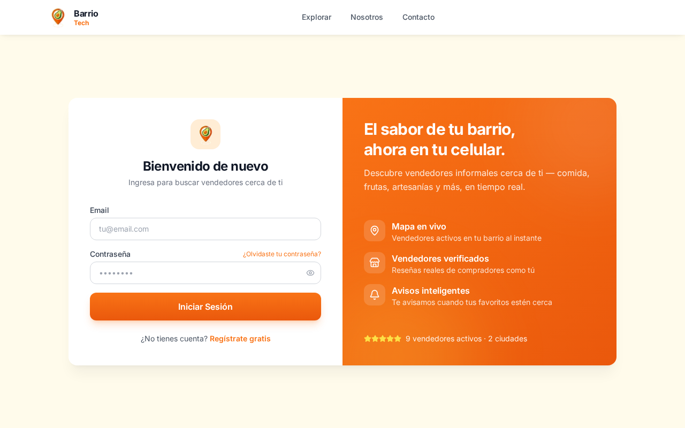
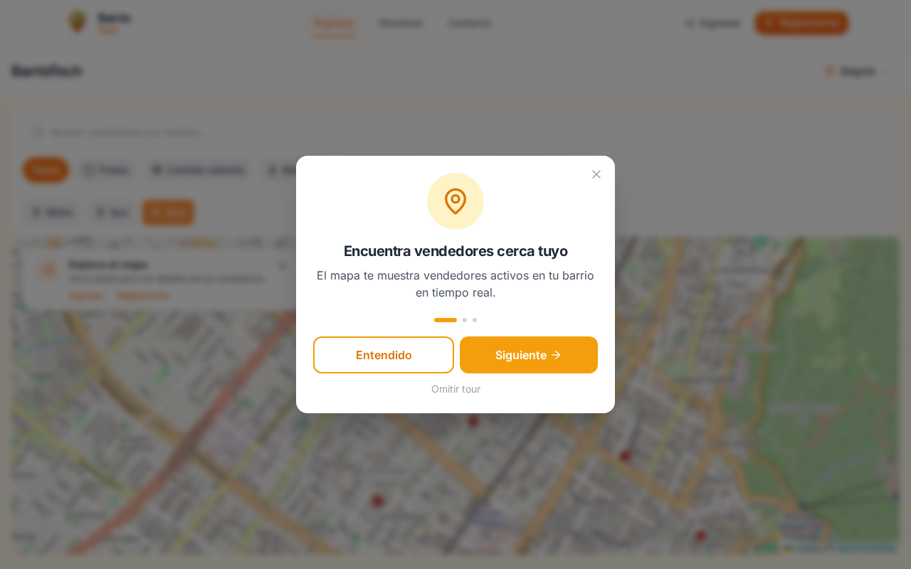

# GPS Street Sellers (BarrioTech)

> Real-time geolocation platform that connects informal street vendors with nearby buyers.


🌐 **Live demo:** [gps.andresmorales.com.co](https://gps.andresmorales.com.co)
🏗️ **Stack:** Next.js 16 · React 19 · PostgreSQL · React-Leaflet · Zustand · JWT

[Hero screenshot — see `docs/screenshots/00-hero.png`](docs/screenshots/00-hero.png)

---

## ✨ Features

- 🗺️ **Real-time vendor map** — buyers see nearby active sellers, GPS freshness < 5 min
- 🛒 **Vendor profiles** — products, reviews, contact
- 📊 **Seller dashboard** — toggle active/inactive, view live metrics
- 🔔 **Push notifications** for stock/distance alerts
- 🔐 **JWT auth** with edge runtime, rate-limited (5 attempts / 5 min / IP)
- 💾 **Automated backups** + health endpoints for monitoring
- ⚡ **PG-backed sessions** with revocation list

---

## 📱 Screenshots

> Public screens captured against the [live demo](https://gps.andresmorales.com.co). Auth-gated screens (vendor detail, seller dashboard, edit profile, settings) live in [`docs/screenshots/`](docs/screenshots/README.md) as TODOs once a demo account is provided.

| | |
|---|---|
|  **Landing page** |  **Onboarding** |
|  **Sign in** |  **Pick your role** |
|  **Live vendor map** | |

---

## 🚀 Quick Start

### Requirements

- Node.js 18+
- PostgreSQL 14+
- npm

### Installation

```bash
# 1. Install dependencies
npm install

# 2. Configure environment
cp apps/web/.env.example apps/web/.env
# Edit apps/web/.env with your DB credentials, JWT_SECRET, etc.

# 3. Generate a JWT secret
openssl rand -base64 64   # paste into JWT_SECRET

# 4. Apply migrations
npm run migrate

# 5. Start dev server
npm run dev
```

App runs on `http://localhost:3000` (override with `PORT`).

---

## 📁 Project Structure

```
gps-street-sellers/
├── apps/
│   └── web/              # Next.js 16 App Router (UI + API routes)
├── packages/
│   └── core/             # Shared types and utilities
├── migrations/           # Numbered, idempotent SQL migrations
├── docs/                 # Ops runbooks + screenshot manifest
└── scripts/
    ├── migrate.js        # Migration runner
    ├── backup-db.sh      # pg_dump wrapper
    └── tests/            # node:test integration suite
```

---

## 🎨 Tech Stack

| Layer | Choice |
|---|---|
| Frontend | Next.js 16 (App Router), React 19, Tailwind CSS |
| Maps | React-Leaflet + OpenStreetMap tiles |
| State | Zustand |
| Backend | Next.js API routes + PostgreSQL (direct via `pg`) |
| Auth | JWT — `jose` for edge/middleware, `jsonwebtoken` for node routes |
| Push | Web Push (`web-push`) |
| Mobile (planned) | Expo |

---

## 🛠️ Scripts

```bash
npm run dev               # Dev server
npm run build             # Production build (core + web)
npm run migrate           # Apply pending DB migrations
npm run migrate:status    # Show migration status
npm run generate-vapid    # Generate VAPID keys for push
npm test                  # Run integration tests
npm run test:auth         # Only auth tests
npm run test:vendors      # Only vendors/products tests
```

---

## 🗄️ Database

Migrations live in `/migrations` as `NNN_description.sql` files, numbered and idempotent.
The runner (`scripts/migrate.js`) applies them in lexicographic order and records applied
names in the `migrations` table.

### Add a new migration

1. Create `migrations/NNN_description.sql` with `CREATE TABLE IF NOT EXISTS`,
   `ALTER TABLE ADD COLUMN IF NOT EXISTS`, etc.
2. Make it idempotent (safe to run twice).
3. Run `npm run migrate`.

---

## 🔐 Auth

Three layers depending on runtime:

- `lib/auth-edge.ts` — edge-runtime safe (middleware), uses `jose`
- `lib/auth.ts` — node-runtime, uses `jsonwebtoken`
- `lib/auth-db.ts` — DB-touching helpers (`isTokenRevoked`)
- `lib/rate-limit.ts` — Postgres-backed rate limiter

**Secret:** `JWT_SECRET` in `apps/web/.env`. Generate with `openssl rand -base64 64`.

---

## 🧪 Tests

Integration tests written with the built-in `node:test` runner — no external test deps.
Each test resets `rate_limit_attempts` before starting so runs don't depend on prior state.

```bash
npm test                  # all tests
npm run test:auth         # only auth
npm run test:vendors      # only vendors/products
```

CI runs the full suite against a Postgres service container (see `.github/workflows/ci.yml`).

---

## 📋 Business Rules

- Active sellers with GPS update < 5 min appear on the map
- GPS update frequency: 15–30 s
- Maximum 10 favorites per buyer
- Notifications only fire for opted-in users
- Rate limit: 5 login attempts / 5 min / IP

---

## 🔧 Operations

### Health endpoints

```
GET /api/health       # Cheap liveness — no DB. For load balancers.
GET /api/health/ready # Deep readiness — pings DB. 200 OK / 503 degraded.
```

```bash
curl -s http://localhost:3000/api/health | jq
# { "status": "ok", "uptime": 12345, "uptimeHuman": "3h 25m", ... }

curl -s -o /dev/null -w "%{http_code}\n" http://localhost:3000/api/health/ready
# 200
```

Point UptimeRobot / BetterStack / Pingdom at `/api/health/ready` (every 60s, alert on non-200).

### Database backups

`scripts/backup-db.sh` produces a gzipped `pg_dump` with timestamp + configurable retention:

```bash
# Manual run (uses apps/web/.env credentials)
./scripts/backup-db.sh

# Override destination + retention
BACKUP_DIR=/var/backups/gps BACKUP_KEEP_DAILY=14 ./scripts/backup-db.sh

# Cron (3am daily)
0 3 * * * /home/telchar/gps-street-sellers/scripts/backup-db.sh >> /var/log/gps-backup.log 2>&1
```

Retention: 7 daily + 4 weekly (Sundays). Optional S3 upload — set `BACKUP_S3_BUCKET`.

**Restore:**

```bash
gunzip -c backups/gps_street_sellers_2026-06-28_030001.sql.gz \
  | psql -h localhost -U postgres -d gps_street_sellers
```

---

## 🚢 Deploy

```bash
npm run build
pm2 start "npm run start" --name gps
# or use pm2 ecosystem.config.js
```

---

## 📜 CI/CD

`.github/workflows/ci.yml` runs lint + build + tests on every PR to `main`/`master`.
Status badges appear at the top of this file.

---

## 🔜 Roadmap

- [x] Push notifications — Stage 2
- [x] Health endpoints + backups — Stage 3
- [x] Screenshot pass (this commit) — Stage 4
- [ ] Auth-gated screenshots in [`docs/screenshots/`](docs/screenshots/README.md)
- [ ] Legal Colombia (Ley 1581) — Stage 5
- [ ] Security headers (HSTS, CSP) + stricter rate limits — Stage 6
- [ ] Realtime GPS tracking (WebSockets)
- [ ] Mobile app (Expo)
- [ ] Integrated payments (Wompi / Nequi)
- [ ] Next.js 16 → 17 upgrade when stable

---

## 📄 License

MIT — see [`LICENSE`](LICENSE).
